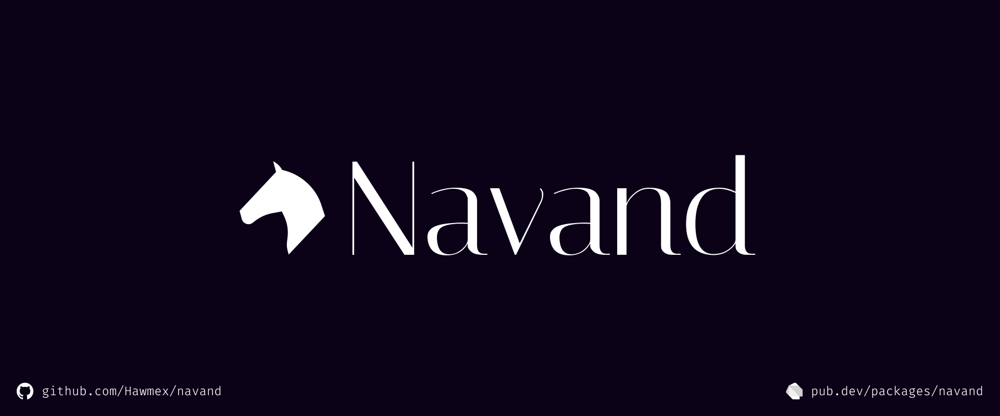

---

[ [GitHub](https://github.com/Hawmex/navand) |
[Pub](https://pub.dev/packages/navand) |
[Docs](https://pub.dev/documentation/navand) ]

Navand, meaning "a swift horse" in Persian, is a Dart web framework that lets
developers create UIs with a widget model similar to Flutter. Navand apps are
compiled into JS and painted with HTML & CSS.

- [Code of Conduct](./CODE_OF_CONDUCT.md)
- [Contributing to Navand](./CONTRIBUTING.md)
- [Changelog](./CHANGELOG.md)

## License

Navand by Hamed Araab is licensed under CC BY 4.0. To view a copy of this
license, visit http://creativecommons.org/licenses/by/4.0/
